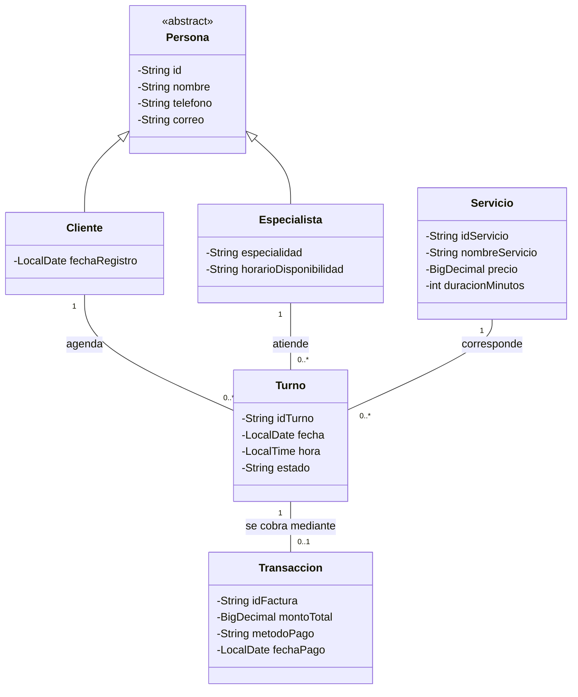

# BkenS ERP

## Contexto

BkenS ERP es un proyecto academico individual para apoyar la gestion basica de un centro de estetica y servicios especializados. El sistema organiza informacion de clientes, especialistas, servicios, turnos y transacciones en un modelo orientado a objetos.

## Problema y objetivo

La administracion manual de las citas y los pagos puede dificultar el seguimiento de la agenda, la disponibilidad del personal y los ingresos. El objetivo del proyecto es ofrecer una base modular para registrar y consultar estos datos de forma sencilla.

## Alcance inicial

- Modelar clientes y especialistas a partir de los datos comunes de una persona.
- Representar servicios, turnos y transacciones con sus relaciones.
- Preparar las entidades para persistencia local, sin motor de base de datos.

La interfaz de usuario, las reglas de negocio, la agenda operativa y la capa de lectura y escritura de archivos quedan para siguientes incrementos.

## Modelo de dominio

## Decisiones de diseno

- `Persona` concentra los datos comunes y es abstracta; `Cliente` y `Especialista` especializan ese contrato mediante herencia.
- Los atributos son privados y se exponen mediante constructores, getters y setters.
- `LocalDate` y `LocalTime` representan fechas y horas; `BigDecimal` representa importes monetarios.
- `Turno` mantiene referencias a sus entidades relacionadas, y `Transaccion` referencia el turno cobrado.

ola